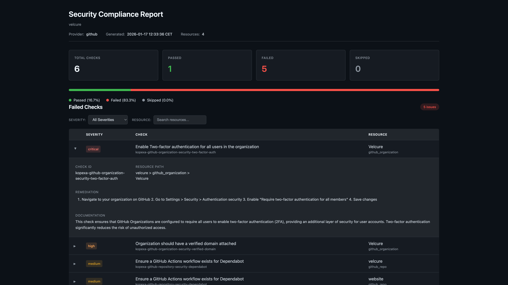

<div align="center">
  

  # kspec

  **The Enterprise-Grade Policy-as-Code Engine.**

  [](https://github.com/kopexa-grc/kspec/actions/workflows/ci.yml)
  [](https://github.com/kopexa-grc/kspec/actions/workflows/codeql.yml)
  [](https://goreportcard.com/report/github.com/kopexa-grc/kspec)
  [](https://scorecard.dev/viewer/?uri=github.com/kopexa-grc/kspec)
  [](LICENSE)

  <p align="center">
    <b>Validate. Secure. Comply.</b><br />
    A modern, extensible framework for defining and enforcing security policies across your digital infrastructure.
  </p>

  
</div>

---

## Overview

**kspec** is a powerful policy engine designed to bridge the gap between complex security requirements and automated validation. Built for cloud-native environments, it allows organizations to define security posture as code, ensuring consistent enforcement across cloud platforms, SaaS applications, networks, and infrastructure.

Whether you are auditing cloud configurations, verifying GitHub repository security, enforcing Microsoft 365 compliance, or validating TLS settings, **kspec** provides the primitives to build, test, and run policies at scale.

## Key Features

- **Multi-Cloud Support**: Scan AWS accounts, Azure subscriptions, Microsoft 365 tenants, and GitHub organizations from a single tool
- **Policy-as-Code**: Define your security expectations in clear, version-controlled YAML with CEL expressions
- **Extensible Provider Architecture**: Modular design with providers for Azure, MS365, GitHub, Network, and more
- **Interactive TUI**: Beautiful terminal UI showing real-time scan progress and results
- **High Performance**: Built in Go for speed, portability, and minimal overhead
- **CI/CD Ready**: Non-interactive mode with structured logging (`--no-ui`) and multiple export formats
- **Export Reports**: Generate compliance reports in CSV, XLSX, JSON, or interactive HTML format

## Supported Providers

| Provider | Description | Documentation |
|----------|-------------|---------------|
| **AWS** | Scan AWS accounts for security compliance (IAM, S3, EC2, RDS, Lambda, EKS, and 50+ services) | [Provider Guide](docs/providers/aws.md) |
| **Azure** | Scan Azure subscriptions for security compliance | [Provider Guide](docs/providers/azure.md) |
| **Microsoft 365** | Scan M365 tenants for identity and security settings | [Provider Guide](docs/providers/ms365.md) |
| **GitHub** | Scan organizations and repositories for security best practices | [Provider Guide](docs/providers/github.md) |
| **Hetzner Cloud** | Scan Hetzner Cloud projects for infrastructure security | [Provider Guide](docs/providers/hetzner.md) |
| **Cloudflare** | Scan DNS, WAF, Zero Trust, and security settings | [Provider Guide](docs/providers/cloudflare.md) |
| **Atlassian** | Scan Jira, Confluence, and admin settings | [Provider Guide](docs/providers/atlassian.md) |
| **Factorial HR** | Scan HR data for compliance (employees, contracts, documents) | [Provider Guide](docs/providers/factorial.md) |
| **Network** | Validate TLS, DNS, and HTTP security configurations | [Provider Guide](docs/providers/network.md) |
| **OS** | Scan local system services, packages, and files | [Provider Guide](docs/providers/os.md) |
| **SBOM** | Scan Software Bill of Materials for vulnerabilities and licenses | [Provider Guide](docs/providers/sbom.md) |

## Installation

### From Source

```bash
# Clone the repository
git clone https://github.com/kopexa-grc/kspec.git
cd kspec

# Build
go build -o kspec ./cmd/kspec

# Verify installation
./kspec --help
```

## Quick Start

### Scan AWS Account

```bash
# Set your AWS credentials
export AWS_ACCESS_KEY_ID="your-access-key"
export AWS_SECRET_ACCESS_KEY="your-secret-key"
export AWS_REGION="us-east-1"

# Scan an AWS account
kspec scan aws -f policies/aws-security.yml
```

### Scan GitHub Organization

```bash
# Set your GitHub token
export GITHUB_TOKEN="ghp_xxxxxxxxxxxx"

# Scan an organization
kspec scan github org <organization-name> -f policies/github-security.yml
```

### Scan Azure Subscription

```bash
# Set Azure credentials
export AZURE_TENANT_ID="your-tenant-id"
export AZURE_CLIENT_ID="your-client-id"
export AZURE_CLIENT_SECRET="your-client-secret"

# Scan a subscription
kspec scan azure <subscription-id> -f policies/azure-security.yml
```

### Scan Microsoft 365 Tenant

```bash
# Scan M365 tenant
kspec scan ms365 <tenant-id> \
  --client-id <client-id> \
  --client-secret <client-secret> \
  -f policies/ms365-security.yml
```

### Scan Network Host

```bash
# Scan TLS and HTTP security
kspec scan network host example.com -f policies/tls-security.yml
```

### Scan Hetzner Cloud Project

```bash
# Set your Hetzner Cloud API token
export HCLOUD_TOKEN="your-api-token"

# Scan all resources in a project
kspec scan hetzner -f policies/hetzner-security.yml
```

## Output Options

### Export Results

Export scan results to CSV, XLSX, JSON, or HTML for compliance reporting:

```bash
# Export to CSV
kspec scan aws -f policies/aws-security.yml -o report.csv

# Export to Excel
kspec scan azure <sub-id> -f policies/azure-security.yml -o report.xlsx

# Export to JSON
kspec scan github org <org-name> -f policies/github-security.yml -o report.json

# Export to HTML (visual report)
kspec scan aws -f policies/aws-security.yml -o report.html

# Specify format explicitly
kspec scan aws -f policies/aws-security.yml -o report --export-format xlsx
```

### HTML Reports

Share scan results with stakeholders who don't have CLI access. HTML reports are self-contained files you can email, upload to Confluence, or attach to audit documentation.

```bash
kspec scan aws -f policies/aws-security.yml -o compliance-report.html
```

<a href="https://kopexa.com" rel="noopener noreferrer nofollow">
  
</a>

### Non-Interactive Mode (CI/CD)

Use `--no-ui` for CI/CD pipelines with structured logging via zerolog:

```bash
# Run without interactive UI
kspec scan aws -f policies/aws-security.yml --no-ui

# Combine with export
kspec scan azure <sub-id> -f policies/azure-security.yml --no-ui -o results.csv
```

Output example:
```
12:34:56 INF Scan initialized target=my-subscription
12:34:57 INF Discovery started
12:34:58 INF Discovery complete
12:34:58 INF Scan started
12:34:59 INF Storage encryption enabled id=azure-storage-encryption status=PASS
12:34:59 WRN Public blob access disabled id=azure-storage-public-access status=FAIL severity=high details="Public access is enabled"
12:35:00 INF Scan complete
12:35:00 INF Scan summary total=10 passed=8 failed=1 skipped=1
```

### Concurrency Control

kspec uses adaptive concurrency to parallelize resource discovery and scanning. By default, it automatically scales workers based on your system's CPU cores.

```bash
# Auto concurrency (default) - scales based on available CPUs
kspec scan aws -f policies/aws-security.yml

# Limit maximum concurrent workers
kspec scan aws -f policies/aws-security.yml --max-workers 10

# Disable concurrency (run sequentially for debugging)
kspec scan aws -f policies/aws-security.yml --sequential
```

The scanner parallelizes:
- **Resource discovery** - Multiple resource types discovered concurrently
- **Resource fetching** - Instances fetched in parallel with rate limiting
- **Policy evaluation** - CPU-bound checks run concurrently

Built-in rate limiting prevents API throttling for each provider (AWS, Azure, GitHub, etc.).

## Policy Library

The repository includes pre-built security policies:

| Policy | Provider | Description |
|--------|----------|-------------|
| [Azure Security](policies/azure-security.yml) | Azure | Storage encryption, SQL auditing, Key Vault protection, NSG rules |
| [MS365 Security](policies/ms365-security.yml) | MS365 | MFA enforcement, Conditional Access, identity protection, Teams security |
| [GitHub Security](policies/github-security.yml) | GitHub | Branch protection, 2FA, repository security settings |
| [Hetzner Security](policies/hetzner-security.yml) | Hetzner | Server protection, firewall rules, SSH key security, network isolation |
| [TLS Security](policies/tls_security.yaml) | Network | TLS versions, cipher suites, PFS, AEAD ciphers |
| [Certificate Security](policies/certificate_security.yaml) | Network | Expiration, validity period, signature algorithms |
| [HTTP Security](policies/http_security.yaml) | Network | Security headers (HSTS, CSP, X-Frame-Options) |
| [DNS Security](policies/dns_security.yaml) | Network | DNS record validation |
| [Email Security](policies/email-security.policy.yaml) | Network | SPF records, DMARC enforcement |

## Writing Policies

Policies are defined in YAML with CEL (Common Expression Language) queries:

```yaml
policies:
  - uid: my-security-policy
    name: My Security Policy
    version: 1.0.0
    require:
      - provider: azure
    groups:
      - title: Storage Security
        checks:
          - uid: storage-https-required

queries:
  - uid: storage-https-required
    title: Ensure HTTPS is required for storage accounts
    resource: azure_storage_account
    impact: 90
    query: |
      has(resource.properties) &&
      resource.properties.supportsHttpsTrafficOnly == true
    docs:
      desc: |
        Storage accounts should require HTTPS to encrypt data in transit.
      remediation: |
        Enable "Secure transfer required" in the storage account settings.
```

## Architecture

kspec operates on a **Provider-Resource-Policy** model:

1. **Providers** (AWS, Azure, MS365, GitHub, Network, etc.) connect to target assets
2. **Resources** expose structured data from the target (storage accounts, users, repos)
3. **Policies** define expected security state using CEL expressions
4. **Scanner** orchestrates discovery, fetching, and policy evaluation
5. **TUI** displays real-time progress and results

```
┌─────────────┐     ┌──────────────┐     ┌─────────────┐
│   Provider  │────▶│   Resources  │────▶│   Scanner   │
│  (Azure)    │     │  (Storage,   │     │  (Evaluate  │
│             │     │   SQL, etc)  │     │   Policies) │
└─────────────┘     └──────────────┘     └──────┬──────┘
                                                │
                                                ▼
                                         ┌─────────────┐
                                         │     TUI     │
                                         │  (Results)  │
                                         └─────────────┘
```

## Documentation

- **[Documentation Index](docs/README.md)** - Complete documentation
- **[Quickstart Guide](docs/QUICKSTART.md)** - Scan a host in 5 minutes
- **[Installation](docs/installation.md)** - Installation instructions
- **[Writing Policies](docs/policies.md)** - Create custom security policies
- **[CLI Reference](docs/reference/cli.md)** - Command line options
- **[CEL Expressions](docs/concepts/cel-expressions.md)** - Writing policy queries

## CI/CD Integration

### GitHub Actions

```yaml
name: Security Scan

on:
  schedule:
    - cron: '0 6 * * *'
  workflow_dispatch:

jobs:
  scan:
    runs-on: ubuntu-latest
    steps:
      - uses: actions/checkout@v4

      - name: Setup Go
        uses: actions/setup-go@v5
        with:
          go-version: '1.21'

      - name: Build kspec
        run: go build -o kspec ./cmd/kspec

      - name: Run Security Scan
        env:
          AZURE_TENANT_ID: ${{ secrets.AZURE_TENANT_ID }}
          AZURE_CLIENT_ID: ${{ secrets.AZURE_CLIENT_ID }}
          AZURE_CLIENT_SECRET: ${{ secrets.AZURE_CLIENT_SECRET }}
        run: |
          ./kspec scan azure ${{ secrets.AZURE_SUBSCRIPTION_ID }} \
            -f policies/azure-security.yml \
            --no-ui \
            -o scan-results.csv

      - name: Upload Scan Results
        uses: actions/upload-artifact@v4
        if: always()
        with:
          name: security-scan-results
          path: scan-results.csv
```

## Contributing

Contributions are welcome! Please read the license terms before contributing.

## License

This project is licensed under the **Elastic License 2.0 (ELv2)**.

- **Commercial use**: You are free to use this software commercially, including for auditing, consulting, and security assessments
- **Managed Service**: You may **not** provide this software as a hosted or managed service to third parties
- **Modifications**: You may modify and distribute the software, subject to the license terms

See [LICENSE](LICENSE) for the full license text.

### What's Allowed

- Using kspec internally at your company
- Using kspec to audit or assess client infrastructure (consultants, auditors)
- Modifying kspec for your own use
- Distributing kspec with your modifications (with license notices)

### What's Not Allowed

- Offering kspec as a hosted/managed service (SaaS)
- Removing or circumventing license functionality

---

<div align="center">
  <p>Built with care by <a href="https://github.com/kopexa-grc">Kopexa GRC</a></p>
</div>
